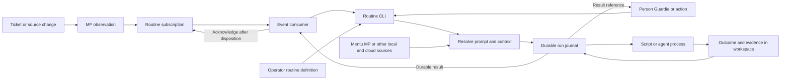

# Running terminal routines from agents actions and events

A person, Guardia, another agent, an action, or a monitor event can invoke the same predefined
routine through a terminal CLI. The routine retrieves its prompt and work context, runs within
declared limits, and returns a durable result reference. Prompts and context can live locally
or in the cloud. No agent conversation has to remain active between jobs.

A routine may be an ordinary program or a bounded agent task: validate an artifact, collect a
report, or review a ticket and publish findings. Programmatic invocation uses a CLI process;
it does not require someone to type into a visible terminal window.

**Status: broader design with a bounded implementation.** The protocol's subscriptions,
manual acknowledgement, leases and native Codex preview exist. As of 2026-10-10,
[Mentu Recipes PR 12](https://github.com/mentu-ai/mentu-recipes/pull/12) implements a fixed
private dispatch policy, pinned local/HTTPS inputs, a durable run journal, an idempotent
reporter contract, and a one-shot MP consumer. It has been exercised with real read-only
Codex execution. General named Mentu/MCP resolvers, authenticated multi-user invocation
and an automatic routine supervisor remain design work. That bounded execution test does
not establish idle wake or app tool parity.

See [Shared terminal peers and event driven routines](shared-terminal-peers.md) for the
relationship to delivery into an already open conversation.

## The execution model



The operator registers the routine and grants callers permission to invoke it. An event
consumer mechanically matches events to that definition and calls the same runner available
to people and agents. Judgment, when needed, happens inside the agent job. The MP server
retains observations and cursors; it never needs to run the model or know a provider's terminal UI.

Four entry points share this proposed contract:

- **Manual:** the person invokes the routine at a shell prompt with a work reference.
- **Agent or action:** Guardia, another provider, or an automated action starts the CLI with
  a structured request and receives a machine-readable outcome under its granted authority.
- **Monitor event:** the launcher pulls an observation from its dedicated subscription.
- **External trigger:** a webhook or scheduler activates a consumer, which fetches and
  validates the referenced observation before launching. The transport notification alone
  does not establish a completed delivery.

An event source or armed consumer still has to exist to detect work. It can be ordinary
runtime code that waits between events. There is no requirement to keep a model turn running,
arm Claude Code's Monitor tool, or start a native monitor inside each short-lived job.

## One CLI contract for every caller

The proposed interface accepts a registered routine name and a structured request. The command
name below is illustrative; no `routine-runner` executable is shipped in this repository.

```bash
/path/to/routine-runner run --routine ticket-review --request request.json --json
```

An agent or action executes that same command as a subprocess with fixed arguments. No
foreground TTY is required for a bounded invocation. The request supplies references and an
idempotency key, rather than embedding credentials or an arbitrary shell command:

```json
{
  "request_id": "review-ticket-412-revision-3",
  "trigger": {
    "kind": "monitor",
    "source": "monitor:workspace-tickets",
    "id": "event-412",
    "digest": "sha256:<observation-digest>"
  },
  "inputs": {
    "work": {
      "resolver": "mentu-workspace",
      "ref": "ticket-412",
      "revision": "3"
    }
  }
}
```

Resolver names refer to operator configuration. The reference syntax in this example belongs
to the proposed resolver contract; it is not a new Mentu endpoint or MP wire method. Manual
and action calls use their own trigger kind and do not need an MP observation. The authenticated
caller is established from the configured execution credentials or invocation gateway; a
caller-supplied actor string cannot authorize itself.

The runner returns a JSON envelope with `run_id`, `request_id`, routine version, status,
disposition, evidence references, resolved-input manifest reference, and any retry or input
requirement. Logs go to a separate stream or artifact. Exit status distinguishes accepted
completion, blocked/input-required, retryable failure, and permanent failure; the JSON
disposition distinguishes successful work from a valid no-action outcome. Accepted or started
responses are distinct from a finished run with a durable result.

The runner scopes request IDs to the authenticated caller and routine. Repeating a request
returns the existing run or result; changed inputs under the same ID produce a conflict.
An event consumer additionally deduplicates by subscription and observation identity.

The initial CLI waits for the bounded job and its durable outcome. If execution needs a
human decision that the invocation cannot obtain, it records a blocked result for the caller;
it does not pretend success or relax permissions to continue. Asynchronous submission would
need a separately implemented durable job host and status interface. Backgrounding a process
alone would not provide that contract.

## Define the routine before execution

The following are proposed launcher settings, not additions to MP wire objects or a runnable
configuration schema.

| Setting | What the operator fixes |
| --- | --- |
| Routine identity | Stable name, version, definition digest, and authorizing principal |
| Callers | Authenticated people, agents, or actions allowed to invoke this routine |
| Trigger | Subscription, permitted observation types, recipient, and eligibility predicate |
| Program | Executable and fixed argument template, or a supported provider adapter |
| Prompt | Registered local or cloud resource, authorized version or digest, and expected format |
| Context resolvers | Named Mentu, MP, file, or other source adapters; credential bindings and allowed resources |
| Workspace | Working directory, allowed tools, output destination, and write permissions |
| Input | Validated work reference, source digest, observation identity, and run ID |
| Session policy | Fresh conversation for each job, or one explicit resumable thread |
| Limits | Wall time, available usage limits, maximum attempts, and concurrency |
| Result | Required disposition and evidence, accepted no-action reasons, failure policy |
| Lifetime | Invocation or supervisor owner, stop behavior, and cancellation of owned child processes |

An interactive terminal supervisor can own a sequence of jobs while it remains open. A
programmatic caller can instead own a single bounded invocation. Both need explicit process
ownership, cancellation, and time limits. The foreground-TTY requirement of the existing
peer migration launcher is specific to that launcher; it is not a requirement for this new
routine CLI. A persistent service is a third possible owner, with its own declared operating
policy rather than an inferred extension of a terminal session.

A fresh agent job loads the routine's instructions and the ticket's context. Resuming a thread
requires that exact configured thread, an available writer lock, and a supported host launch
path. A busy thread remains queued or is reported blocked. The launcher never kills its
current owner, steals its lock, or silently selects a different conversation.

The event supplies data within this standing authorization. It cannot replace the executable,
instructions, workspace, credentials, or limits. Pass validated parameters through structured
arguments or an input file; never evaluate event text as shell code. Keep reader tokens with
the consumer, and give each job only the credentials required for its configured work.

For example, a ticket assigned to a review routine can start a fresh agent job that reads the
referenced change, runs allowed checks, posts findings as its own workspace identity, and
exits. A later ticket can start another job. Neither job requires a resident agent monitor.

## Resolve prompts and current information from their sources

Routine code, prompt storage, work storage, and the model provider are independent choices.
A CLI running on a laptop can fetch an approved prompt from a cloud registry, read a Mentu
ticket and its evidence, fetch the triggering MP observation, and run the configured provider.
The caller does not have to copy all that information into a message.

The proposed resolver layer has three jobs:

1. **Resolve the routine prompt.** Fetch the operator-approved resource through its configured
   adapter. Verify its version or expected digest before treating it as routine instructions.
   Record the exact bytes or an immutable accessible snapshot plus its digest. An authorized
   prompt update creates a new effective routine version; a retry uses the original version.
2. **Resolve work context.** Fetch the referenced ticket, MP observation, attachments, or other
   required records using their own source credentials. Validate event-linked digests against
   the referenced snapshot. When the routine also needs current state, fetch it separately,
   record its revision and retrieval time, and check whether the work is still applicable.
3. **Produce an input manifest.** Record resolver, canonical reference, revision, digest,
   retrieval time, and freshness for every item, including unavailable inputs. Retain private
   snapshots according to workspace policy; the public run record may contain only references
   and digests. Pass only the permitted context to the job.

| Source | What a configured adapter retrieves |
| --- | --- |
| Mentu workspace | Ticket or work record, current state, related evidence, and authorized result destination |
| Monitor Protocol | Triggering observation and provenance through the participant's authorized subscription; monitor state when needed |
| Cloud prompt registry or HTTPS store | Approved prompt resource at an immutable version or checked digest |
| Other API or MCP source | Declared records and artifacts through the source's authenticated interface |
| Local files | Registered prompt or context paths within the routine's allowed workspace |

Adapters bind credentials to configured destinations. References in an event cannot redirect
tokens to an arbitrary host or select another participant's identity. Remote responses remain
data unless they match the authorized prompt resource and version; instructions found inside
a ticket, attachment, or observation do not become routine instructions.

Required fetch failures, unauthorized access, digest mismatches, and unacceptable staleness
produce a blocked or failed run with the missing input identified. Optional inputs can be
omitted only when the routine defines that behavior. A cache is usable only within declared
freshness rules, and its use is recorded. Retries reuse pinned inputs; refreshing current
state creates a new recorded attempt with any changed work decision made explicit.

The run record preserves the initiating caller, authorizing principal, execution actor,
provider/runtime when applicable, trigger, prompt version, and input manifest. A job writes
as its own authorized actor. Invoking a routine as Guardia does not allow another process to
impersonate Guardia merely by copying a name.

## From observation to completed run

The initial implementation should handle one outstanding observation per subscription. This
makes cumulative acknowledgement and crash recovery explicit before adding parallelism.

1. **Read and validate.** Pull without acknowledging. Validate the source, fingerprint,
   work reference, and configured eligibility. Recheck the authoritative ticket before
   launching; a ticket may already have been closed or reassigned.
2. **Establish durable identity.** Atomically reserve a run keyed by the stable routine identity,
   subscription, and observation `(source, id)`. Pin the routine version inside the run; an
   updated routine cannot make an old event look new. Store the digest, sequence, input
   reference, attempt number, and definition digest. A duplicate with changed content is a
   conflict requiring attention.
3. **Check existing work.** A completed run reuses its receipt. An active run is observed,
   not spawned again. Claim shared work through the ticket system when it requires exclusive
   ownership. If using MP leases, the subscription needs a separately granted `act` capability.
4. **Resolve inputs and record launch intent.** Persist the verified prompt and context manifest,
   then the intent before creating the child. Launch
   the fixed program, identify the actual runtime and thread where applicable, and record
   startup evidence tied to the run. Process creation alone is not a completion receipt.
5. **Supervise.** Enforce configured limits, maintain subscription liveness and any work lease,
   and detect process exit. Invocation-owner loss, explicit stop, or lost ownership stops further
   launches. Cancellation affects only children owned by this supervisor.
6. **Record disposition.** Validate the required result, persist its workspace record and
   local receipt, and settle any ticket claim or work lease according to its own contract.
   A process exit code of zero alone does not prove the ticket was handled.
7. **Acknowledge.** Advance the subscription only after the disposition is durable. If the
   acknowledgement response is lost, retry it from the receipt without rerunning the job.

The event consumer validates that the runner's receipt matches its reserved run, source event,
and required workspace evidence. A child's printed JSON is a claim, not independent proof of
those effects. Only the consumer holding that subscription commits its cursor. Manual and
action invocations without an MP delivery have no MP acknowledgement to send.

Different observations may refer to the same ticket revision. The observation key deduplicates
delivery; an effect key based on the routine, work item, and revision deduplicates work. Use
idempotent writes or conditional ticket transitions for external effects. Changing a routine
version does not automatically replay completed work; replay must be a deliberate new run.

## Recovery and concurrency

Proposed journal phases are `pending`, `launching`, `running`, `finished`, and `acknowledged`.
A separate outcome records success, no action, failure, cancellation, or a need for input.
These are local launcher states, not new protocol observation types.

| Interruption | Required recovery |
| --- | --- |
| Before launch intent is durable | Redelivery can reserve the run normally. |
| After intent but before startup is recorded | Reconcile using the run ID and exact process identity. If launch is uncertain, retain an unresolved run; do not blindly spawn another child. |
| Child is still running when the supervisor restarts | Reattach only when the adapter can prove ownership and the configured lifetime policy permits recovery; otherwise require reconciliation. |
| Child performed an effect but no receipt exists | Inspect the authoritative result using the effect key before retrying. |
| Receipt exists but acknowledgement failed | Retry acknowledgement only. |
| Retry limit or input requirement is reached | Record the failure or blocked result. Acknowledge only if the configured workflow durably accepts that disposition and gives follow-up work an owner; otherwise keep it pending. |

A local lock protects one supervisor's journal. It does not coordinate separate machines.
An MP lease is an expiring work claim, not a process lock or a guarantee that a stale process
cannot still write. Distributed execution needs an authoritative claim or fencing mechanism
at the system receiving effects, plus idempotent results. Lease completion does not replace
the launcher's retained deduplication record.

If parallel execution is added, preserve acknowledgement order: a cumulative cursor must not
pass an earlier unfinished observation. Use independent subscriptions for independently
acknowledged work or maintain a contiguous completed range. Independent participant
subscriptions provide independent delivery; exclusive work requires a separate claim.

The consumer must also respect subscription retirement and retention. It keeps pulling or
otherwise renewing liveness during long jobs, and reports cursor expiry or lost authorization.
It never seeks past unfinished work to make a routine appear healthy.

## Evidence for a live routine launch

The first live trial should use a harmless routine that records a ticket response:

1. Record the operator's routine definition, runtime version, invocation or supervisor owner, subscription,
   and empty run journal. Confirm no child job is running.
2. Arm the supervisor, then create a fresh ticket with a unique test value. Record both times.
3. Capture the MP observation, durable launch intent, child startup, and matching run identity.
   No person should manually enter a start command after creating the ticket.
4. Capture the ticket disposition, local receipt, child exit, and subsequent acknowledgement.
5. Redeliver the observation and verify that no second effect or job is created. Test crashes
   around launch and around acknowledgement using a deterministic script before a live agent.
6. Stop the supervisor, send another eligible event, and verify that no new process starts.

A programmatic invocation test should also call the same routine from an agent or action,
resolve an approved cloud prompt and Mentu/MP context, and verify the input manifest and returned
result reference. Change a prompt digest, deny a required source, and retry the request to
verify that failures are explicit and completed effects are not repeated.

A script trial establishes mechanical execution. A provider-specific agent trial additionally
establishes that its adapter can start that agent and retrieve its result. Neither result
establishes idle wake in an existing conversation; test that path separately.

## Relationship to the existing protocol

This consumer design uses [manual acknowledgement and work leases](../../spec/04-delivery.md)
without adding protocol methods. MP's `run:<ref>` rule vocabulary identifies a mechanical
action reference; the reference server validates and stores rules but does not implement a
general process executor. Declaring such a rule does not currently start a program.

[P9](../../spec/00-principles.md#p9-the-daemon-never-infers) currently describes judgment in a
subscribed interactive session. The proposed programmatic agent-job mode broadens that host
model and must be reconciled explicitly when implemented. This design keeps inference outside
the MP server and does not silently change the current specification or the native adapter.

The [session bridge contract](../session-bridge.md) still binds delivery to an already open
conversation. A routine launcher is a separate integration with an explicit spawn policy.
Provider support is demonstrated adapter by adapter. Both integrations can share the same
workspace and observations while retaining their own subscriptions and evidence.
