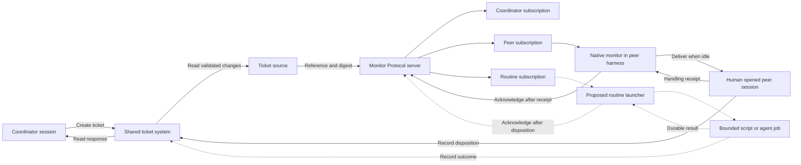

# Shared terminal peers and event driven routines

A shared workspace can deliver a ticket to an existing agent conversation or start a bounded
routine in response to an event. Both are useful: an ongoing conversation provides continuity,
while a routine runs only when work arrives. Each participant keeps its own identity,
permissions, and delivery position. The ticket system supplies the work; Monitor Protocol
carries observations of changes; a consumer chooses the configured execution path.

The [native Codex preview](../../integrations/codex-native/README.md) implements delivery into
an existing idle session. The local Constructo trial supplies a ticket source and a
human-operated launcher. The [event-triggered routine launcher](event-triggered-routines.md)
describes the broader contract. A bounded local/HTTPS dispatcher and one-shot MP consumer
are implemented in [Mentu Recipes PR 12](https://github.com/mentu-ai/mentu-recipes/pull/12).
A continuous general supervisor remains design work. The local trial scripts are also not
yet a public launcher or ticket adapter package.

## Two ways to execute work

| Mode | What is running between events | What happens when work arrives | Suitable use |
| --- | --- | --- | --- |
| Existing session | Open frontend and native consumer; no model turn is needed for waiting | Deliver to the same conversation when idle | A peer reviewing tickets with ongoing conversational context |
| Bounded routine | No persistent agent session is required; an event source or supervisor exists when automatic triggering is wanted | A person, agent, action, or event consumer invokes a configured script or agent job, records its result, and exits | A validation script, report, or bounded ticket review |

A person can launch a routine directly from the shell; Guardia, another agent, or an action
can invoke the same CLI programmatically under its granted permissions. Both use the same
routine definition, limits, and result contract. The proposed runner resolves the routine's
prompt and context from configured local or cloud sources, including Mentu records and MP
observations, and records which versions it used. A native monitor tool is needed only for the
existing-session path; a short-lived routine can retrieve its inputs at startup.

## What a peer is

Here, a peer is a participant with its own agent conversation, workspace identity, and
subscription. A coordinator can create a ticket for a peer without copying the conversation
into the peer's prompt. The peer receives a reference to the ticket and reads the authoritative
record under its existing permissions.

The current trial brings a peer online through a human shell command. Its launcher starts
the rebuilt Codex App Server and foreground terminal client, then resumes a specific existing conversation. This
starts runtime processes and restores that conversation's context. The native session monitor
then delivers work within that session. A future event-triggered launcher will own the separate
decision to start a fresh routine or resume an explicitly configured conversation; the native
monitor's existing-session lifetime remains unchanged.

## The components and their responsibilities

| Component | Responsibility |
| --- | --- |
| Ticket system | Stores assignments, claims, reports, verification, and closure. Enforces who may write each record. Constructo fills this role in the trial. |
| Ticket source | Reads validated changes and determines their recipients. Publishes a record reference, digest, and provenance into Monitor Protocol. |
| Monitor Protocol server | Retains observations and tracks each subscription's acknowledged position. It does not assign or close tickets. |
| Participant subscription | Selects observations for one participant, with its own reader credential and cursor. Acknowledging one subscription does not advance another. |
| Native session monitor | Runs inside the Codex harness, keeps a private delivery journal, and requests a turn in its existing attended conversation when idle. |
| Human launcher | Connects the terminal to the intended rebuilt runtime and existing thread. Supplies the participant's reader credential to that runtime. |
| Routine runner, proposed | Accepts a programmatic invocation, resolves local or cloud prompt/context references, runs an operator-defined job, and returns durable outcome evidence. |
| Event-triggered routine launcher, proposed | Consumes a dedicated subscription, invokes the routine runner, and owns delivery deduplication and acknowledgement after a durable disposition. |

Solid arrows describe the session workflow; dashed arrows describe the proposed routine path.
The ticket store is the authority for work and its outcome. The local journal retains delivery
and handling evidence; the MP server retains the committed subscription cursor. A handling
receipt does not itself prove that a ticket's acceptance conditions were met.

## How a ticket becomes a turn in an existing session

Consider a coordinator asking a peer to review a proposed change.

1. The human opens the peer in the rebuilt runtime. The operator has already registered an
   allowed source and supplied that participant's reader token to the runtime environment.
2. The peer calls `monitor_start({"source":"tickets-peer"})` and checks `monitor_status`.
   It records READY in the workspace, then finishes its turn. The native consumer keeps running.
3. The coordinator verifies that the peer is idle, then creates a fresh ticket for it.
4. The source publishes an observation containing the ticket record's reference and digest.
   The peer's subscription selects it. Its native consumer journals the delivery before
   requesting idle admission in the same conversation.
5. The peer receives a notification containing a delivery reference and observation
   fingerprint. It uses `monitor_show`, validates the referenced ticket, and deduplicates the
   event. The notification supplies evidence; the existing task and workspace permissions
   determine what the peer may do.
6. The peer handles the ticket and records its disposition through the ticket system using
   its own identity and write credential. A reasoned decision to take no action is also a
   possible disposition.
7. The peer calls `monitor_handled` with that disposition or its record reference. The native
   consumer persists the handling receipt, then acknowledges the source subscription.
8. The coordinator reads the report and follows the ticket system's verification and closure
   rules. If the coordinator also has a compatible active native monitor, the report can be
   delivered through its own subscription; that reverse direction needs its own live test.

The source record digest and the notification fingerprint have different purposes: one
identifies the underlying ticket record's content, while the other identifies the observation
being delivered. Repeated delivery is not independent evidence of another event.

Waiting between turns is ordinary runtime code. The native preview retains events that arrive
while a turn is busy and tries delivery when the conversation is idle. It does not steer an
active turn. A ticket source may poll a store or use an upstream event feed; neither requires
the model to run a polling loop.

## The workspace can outlive a session

The ticket source and MP server can run as workspace services. Ticket records and pending
delivery state can remain after a terminal closes, subject to their retention rules.

The native consumer has a narrower lifetime. It belongs to the exact frontend connection
that armed it. Disconnect, unsubscribe, thread shutdown, interruption, or explicit
`monitor_stop` cancels it. Core checks the ownership and cancellation state again before
admitting a queued wake. A turn already admitted, or an acknowledgement already accepted
by the server, can finish after cancellation.

An explicit start in the same thread can recover its journal. Unhandled deliveries retain
their identity; a durable handling receipt allows a lost acknowledgement to be retried without
another wake. Recovery does not automatically reopen the conversation. An open frontend is
the mechanical attendance boundary; software cannot establish whether the person is looking
at the screen.

This gives continuity to a conversation while it is open and preserves work for later
recovery. A routine runner has its own explicitly configured process lifetime and limits.
A terminal supervisor may own it, or an authorized program can invoke it as a bounded child
job without a foreground terminal UI. Delivery to an ended session does not silently switch
to spawning a routine.

## Keeping the coordinator open during adoption

A workspace can adopt native delivery one participant at a time:

| Arrangement | Peer receives work | Coordinator receives the response |
| --- | --- | --- |
| Existing coordinator with native peer | Native idle delivery in the rebuilt peer harness | Coordinator reads the ticket system explicitly |
| Two native participants | Each has an active native monitor and independent subscription | The response can trigger native delivery to the coordinator |
| Participant without a compatible wake adapter | Participant reads its subscription when attended | Normal ticket system reads |

The current local trial uses the first arrangement. The existing coordinator remains open;
only the peer migrates to the rebuilt runtime. A successful forward wake would establish the
peer's capability. The coordinator's explicit read would not establish a native reverse wake.

Providers can share the observation and receipt contract. Each harness still needs an adapter
that can bind delivery to its own live session. An MCP connection alone does not supply idle
turn admission. See the [session bridge contract](../session-bridge.md).

## Why the peer migration launcher runs from a shell

The native extension is compiled into a particular Codex runtime. Pasting a launcher command
into an installed Codex conversation does not add Rust tools to that running process. Running
the launcher as an agent tool also does not establish the intended human foreground terminal.

The trial launcher therefore runs at the human's shell prompt. It refuses to resume the peer
while the original frontend is alive or another process holds that thread's writer lock.
Opening another terminal tab does not release the original thread. The human exits the old
peer frontend and then launches the replacement; the coordinator can remain open.

For measurement, the launcher starts a dedicated rebuilt App Server on a private Unix socket
and connects the rebuilt terminal client with `--remote`, resuming the fixed existing thread.
The socket permits a read-only idle check without subscribing to the thread or injecting a
message. Exiting the terminal ends the native consumer's ownership; the launcher also stops
the child server it created. It does not stop other frontends or a shared daemon.

The simpler `--no-daemon` launch described in the [build guide](../../integrations/codex-native/README.md)
uses the rebuilt embedded server. The trial uses an explicit remote socket for measurement;
`--remote` and `--no-daemon` cannot be combined.

## What counts as a successful live test

Collect the following evidence in order:

1. The exact rebuilt runtime, attending frontend, thread, and participant subscription.
2. Actual `monitor_start` and `monitor_status` results, followed by a READY record.
3. A verified idle observation before the fresh ticket's creation time.
4. The ticket reference and digest, MP observation, delivery ID, and subsequent native turn.
5. The peer's disposition record, followed by its durable handling receipt and source
   acknowledgement. The observed ticket must not have been acknowledged before handling.

A startup prompt, operator queue message, READY note, or simulated model response is setup or
test evidence, rather than proof of a live provider waking from idle. Record failures and
pending steps explicitly. For two native directions, repeat the idle-before-event measurement
with the coordinator as the receiver. An event-triggered routine needs a separate
[launch-and-result test](event-triggered-routines.md#evidence-for-a-live-routine-launch);
that result establishes automatic launching, not wake support inside an existing session.

## Implementation status

As of 2026-10-10:

- The public native Codex source patch and build bundle are merged. The CLI builds, and
  [45 focused Rust tests pass](../../integrations/codex-native/verification.json), including
  real App Server tests with simulated model responses.
- A local Constructo source and participant launcher are prepared. The source baselines
  existing records, routes new changes to separate subscriptions, and reconciles duplicate
  publication after a crash. Its four focused tests pass. These local trial scripts are
  not part of the public integration bundle.
- The live native peer ticket trial has not yet produced a wake result. The current
  coordinator uses explicit reads; a native reverse wake is also unproven.
- A bounded Recipes consumer has been exercised with actual Codex execution, durable
  Construct reporting, acknowledgement and duplicate suppression. A continuous routine
  supervisor is not shipped here; direct model tool selection and native idle wake require
  separate evidence.

The existing-session use case is ready for attended validation. General launcher packaging,
more ticket-system connectors, full session tool profiles, and additional provider adapters
remain work to be verified. See [capability admission](../tool-capabilities.md) and
[workspace status](../workspace-status.md) for the implemented host-side checks.
